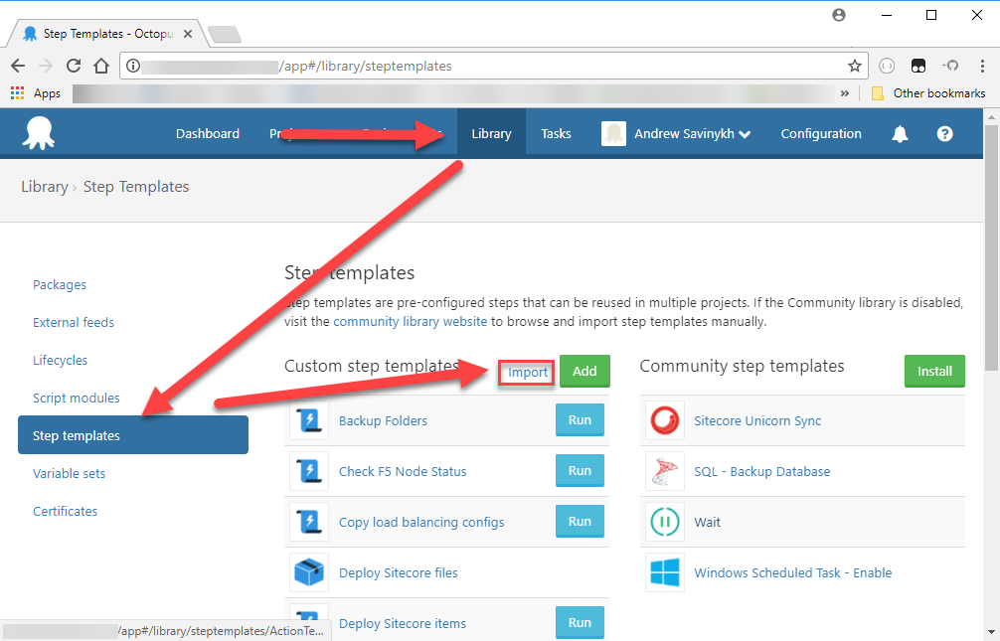
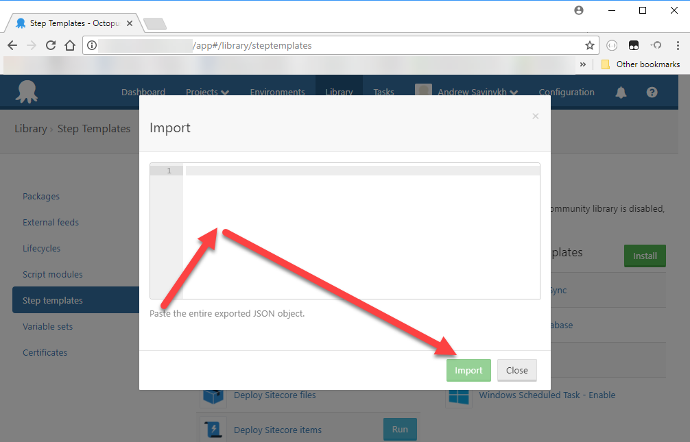
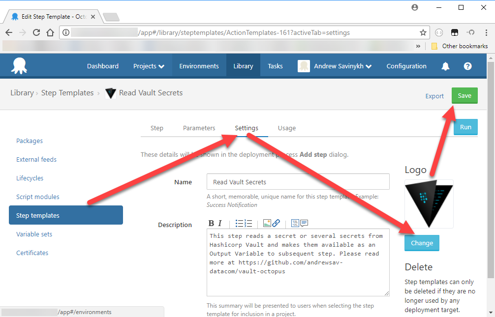
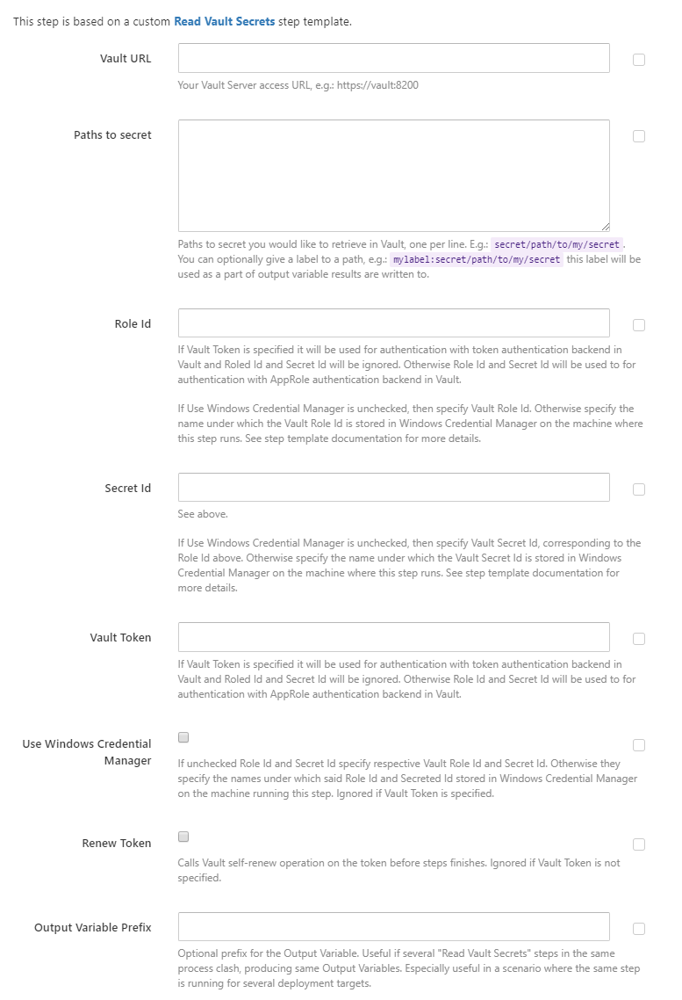

# Octopus Step Template for reading Vault secrets

## Purpose

This Octopus Deploy [Step Template](https://octopus.com/docs/deploying-applications/step-templates) reads a secret or several secrets from your installation of [Hashicorp Vault](https://www.vaultproject.io). It makes them available to subsequent steps by means of an [Output Variable](https://octopus.com/docs/deploying-applications/variables/output-variables).

Note, that you are assumed to have used Vault. This readme can prove difficult to read if you are unfamiliar with basic concepts such as various authentication backend or had limitied experience using the product. Please refer for Vault resources for all these details. This project will be most useful for someone who is already using Vault and just want a standard way for Octopus Deploy to read secrets from it.

## Installation

Clone this repository locally. To install this custom step template, naviage in your browser to your Octopus Deploy installation, choose "Library" from the top menu, and then "Step templates" from the left menu. Press the "Import" link next to the "Custome step templates" heading.



Paste [vault-get-secret.json](vault-get-secret.json) into the pop-up and press the import button.



Optionall you can change the custom step template logo to [another image](vault.png) by selecting the newly imported step from the list and going to the "Settings" tab. Press the change button to select the new image from your local drive. Press "Save" when done.



## Note on security

Octopus Administrators enjoy quite a bit degree of control over Octopus Deploy server. If Octopus Deploy server is installed to run under a local adminstrator (the default option) Octopus Deploy Server admins will be able to run arbitrary scripts on it as local administrator. Any Octopus deploy user that can configure build steps and run them will enjoy this ability too.

Even if the Octopus Deploy installation is running under a [restricted account](https://octopus.com/docs/installation/installing-octopus/permissions-required-for-the-octopus-windows-service), a person who can edit and run a build step can potentially dump any secrets that the deployment process has access to, to the log, [even the ones](https://www.squirrelistic.com/blog/how_to_display_value_of_sensitive_variable_in_octopus_deploy) stored in [senesitive variables](https://octopus.com/docs/deploying-applications/variables/sensitive-variables).

This readme does not cover secure setup of Octopus Deploy installation and Vault installation, so please use your own judgement. You are the one responsivle for making your process secure.

## Configuring step

When you adding a new  step to your process you get to choose a template. "Read Vault Secret" templates will apear on the list. When you choose it you will see the following screen (top part).


Here you name your build step (chooses and adequate name) and select whether you run the step on Deployment Targets or on the Octopus Server. Consider what you are trying to achieve. If you need to just get a single secret or a handful of secrets from Vault that are independent from deployment targets your best bet is using Octopus Server and leaving advanced settings alone. This way, the step will only run once no matter how many deployment targets you have.

If you need to get a secret per deployment target, you probably still want to run the step on the Octopus Deploy server. Configure advanced settings to run on behalf of a role that contains all the deployment targets that you need to get a secret for. The step then will run once per deployment target. You can use the "Output Variable Name" parameter, so that the step writes different output variables per different targets.

It is probably not often useful to run this step on Deployment Targets themselves. For once, they will need access to the Vault server (which is rarely advisable) and sencond, if Windows Credential magager is used (see below) it needs to be setup for each deployment target.

After you configured the above, procedd setting your step parameters.



- Vault Url - url to your Vault installation. Include the Url Scheme and port, do not include the trailing slash
- Paths to secrets - a path inside Vault per line. Can be prefixed by a label separate from the path with colon. The labels are used as a part of Output Variables (see below) to destinguish between keys that come from different secret paths. Since these keys can potentially have the same names they are prefixed by the label. If a label is not provided it's generated from the hash of the path itself.
- Role Id and Secret Id - used to anuthenticate with Vault against AppRole authentication backend. See below. Ignored if Vault Token is specified.
- Vault Token - alternative form of authentication with Vault.
- Use Windows Credential Manager. Ignored if Vault Token is specified. Use Windows Credential Manager to reterive Role Id and Secret Id. In this case Role Id and Secret Id parameters contain the names in the Windows Credential Manager. See below.
- Renew Token. Ignored if Vault Token is not specified. If checked, a call to Vault self-renew is made in the end of the step.
- Output Variable prefix - optional prefix for Output Variables. See below.

## Authenticating with a token

There are a sevaral ways of setting up Vault with token authentication. Probably most secure way, is to get your DevOps engeneer to generate you a new token before deployment that you will enter into Octopus Deploy just before you run the process.

If you are running deployments unattended on schedule, you can create a periodic token in Vault, and check the "Renew Token" parameter, so that the token gets renewed each time the step is run. This flag can also be used with non pereodic tokens, but in this case the token will [eventually expire](https://github.com/hashicorp/vault/issues/1079) despited being renewed. This is subject to policies attached to the token configured in Vault. Refer to [Vault Documentation](https://www.vaultproject.io/docs/concepts/tokens.html) for extended discussion.

## Authenitcation with an AppRole

Alternatively you can authenticated with Roled Id and Secret Id agains AppRole Vault authentication backend. It is recommended to set up both Role Id and Secret Id in vault as sensitive variabled (regardless of the vaule of Use Windows Credential Manager flag).

The step template will use Roled Id and Secret Id furnished, to obtain a brand new Vault token each time the step is run. The step will revoke the token straight after it has been used.

## Windows Credential Manager

Instead of keeping the Roled Id and Secret Id in Octopus, it's possible to keep those in Windows Credential manager. Let's assume that our Roled Id is `cff28e44-569f-4321-9b22-de1452f4644d` and our Secret Id is `75b3add6-1ab3-491d-b86f-74f82fa351fd`. First, RDP to your Octopus Deployment Server and  install CredentialManager Powershell module:

```Powershell
Install-Module CredentialManager –Scope AllUsers -Force
```

With the module installed, login as Octopus Deployment Service user. If you are running Octopus Deployment Service as Local System you can acheive that by running psexec command as described [here](https://stackoverflow.com/a/78691/284111).

Make up a name in Credential Manager for Role and Secret. Let's assume these are `myRoledId` and `mySecretID`. Install your Roled Id and Secret Id to the Windows Credential Manager:

```Powershell
New-StoredCredential -Target myRoleId -Password cff28e44-569f-4321-9b22-de1452f4644d -Type Generic -Persist local
New-StoredCredential -Target mySecretID -Password 75b3add6-1ab3-491d-b86f-74f82fa351fd -Type Generic -Persist local
```

When you configure your "Read Vault Secrets" step, pass `myRoledId` and `mySecretID` to the Role Id and Secret Id parameters respectively and check the "Use Windows Credential Manager" checkbox.

## Ouptut Variables

Familarise youself with [Output Variable](https://octopus.com/docs/deploying-applications/variables/output-variables) concept. As you know, each secret contains arbitrary number of key-value pairs. The build step template write a variable per key found in the secret. The general format of the output variable name is following.

```text
#{Octopus.Action[Step Name].Output.prefix.label.key}
```

Above, `prefix` is what specified in the "Output Variable Prefix" parameter, `label` is what implicit or explicit label corresponding to the secret path passed in "Paths to secrets" parameter, and `key` is the key component of the key-value pair from the Vault secret.

If "Output Variable Prefix" parameter was empty then the `prefix` segment of the Output Variable is excluded.

If there was only one secret path passed as "Paths to secrets" parameter and it did not have explicit lable specified, then the `label` segment of Output Variable is excluded.

These exclusions allow for simpler Output Variable in simpler scenarios. For example the following could be the Output Variable if we did not specify either prefix or label, and only a single secret path was passed to the step.

```text
#{Octopus.Action[Step Name].Output.mySecret}
```

Note, that the exact names of the Output Variables created are written in the Build Step log output.